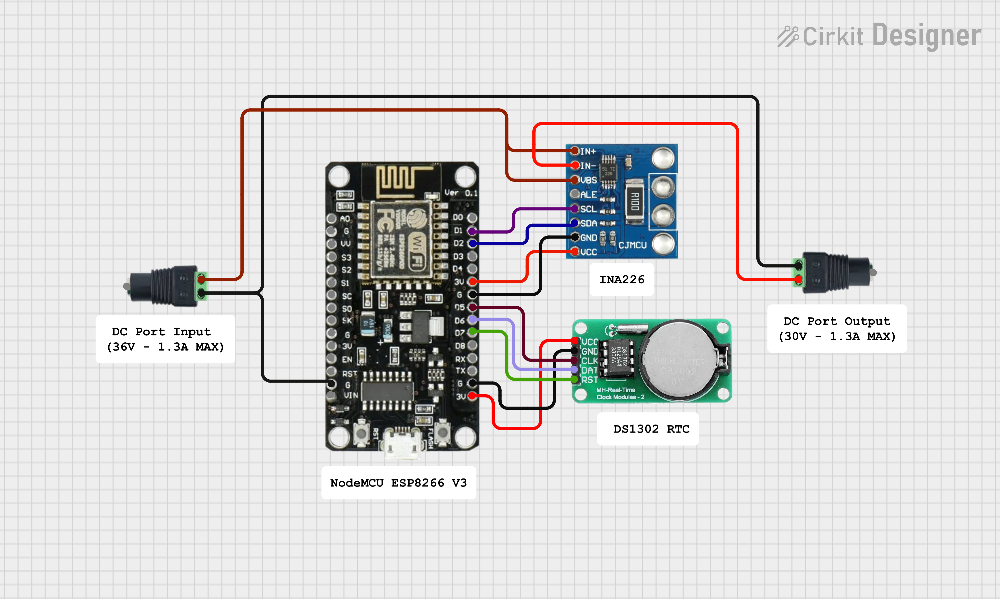

# ⚡ Mini Solar Energy Monitoring System

A real-time, embedded solar monitoring system built on ESP8266 with live WebSocket streaming, historical analytics, and an advanced browser-based dashboard.

> Note: This system is currently under development. Ongoing testing, adjustments, and improvements are being made to enhance its performance and reliability over time.
---
## Measurement Accuracy Disclaimer

This system is designed for DIY monitoring purposes only.  
Readings may differ slightly (±1–2%) from standard digital multimeters due to component tolerances and ADC resolution.

It is not intended for precision or laboratory-grade measurements.

---
## Overview
This project measures and visualizes solar energy parameters including:

* Voltage (V)
* Current (mA / A)
* Power (mW / W)
* Energy Accumulation (Wh / kWh)

It features a **real-time dashboard** with charts, hourly peak tracking, and system controls, all hosted directly on the ESP8266.

---

## Circuit Diagram



## Hardware Used

* ESP8266 (NodeMCU)
* INA226 Current/Voltage Sensor
* DS1302 RTC Module
* Shunt Resistor (e.g. 0.1Ω)
* Solar Panel / Power Source

---

## Features

### Real-Time Monitoring

* Live updates via **WebSocket (no polling)**
* Instant UI refresh without delay

### Data Visualization

* Trend chart (last 60 readings)
* Hourly peak power tracking (0–23)
* Stability indicators for signal quality

### Time-Based Analytics

* RTC-based timestamping (12-hour AM/PM format)
* Automatic midnight reset of daily peak values

### Persistence

* Energy accumulation stored in EEPROM
* Survives power cycles

### Control Panel

* Zero current calibration
* RTC time sync (browser → device)
* Reset energy counter
* Reset peak values
* Light/Dark UI mode

### Network Mode

* Runs as a **WiFi Access Point**
* No internet required
* Captive portal support

---

## System Architecture

```
INA226 Sensor → ESP8266 → WebSocket Server → Web Dashboard
                       ↓
                  EEPROM Storage
                       ↓
                    RTC Time
```

* **Sensor Layer**: Reads voltage/current via INA226
* **Processing Layer**: Filtering, averaging, power calculation
* **Storage Layer**: Energy accumulation (EEPROM)
* **Time Layer**: RTC for hourly/daily tracking
* **UI Layer**: Web dashboard served from PROGMEM

---

## Measurement Limits

| Parameter | Range         |
| --------- | ------------- |
| Voltage   | 0 – 36 V      |
| Current   | 0 – 1.3 A     |
| Power     | ~0 µW – 30+ W |

> Note: Limits depend on shunt resistor and hardware configuration.

---

## How It Works

1. Sensor reads voltage and current every ~1 second
2. Values are filtered (EMA + averaging)
3. Power is calculated:

   ```
   Power (mW) = Voltage × Current
   ```
4. Energy is accumulated over time (Wh)
5. Data is:

   * Broadcast via WebSocket (live UI)
   * Stored in history buffer
   * Compared for hourly peak tracking
6. RTC ensures proper time alignment and daily resets

---

## Calibration

* Use `/zerocal` when no load is connected
* Adjust `CAL_FACTOR` in code for voltage accuracy
* Verify readings using a multimeter

---

## Dashboard Preview

> Real-time web dashboard with:

* Voltage / Current / Power cards
* Trend chart
* Hourly peak graph
* Control panel

---

## Author

- Created with passion ❤ by **Roy Cuadra** 
- Updated Date: 04-24-2026

---

## License

This project is licensed under the **MIT License**.  

---

**Thank you for checking out this project!** 
You are welcome to **fork**, **improve**, or **use** it for learning purposes.
